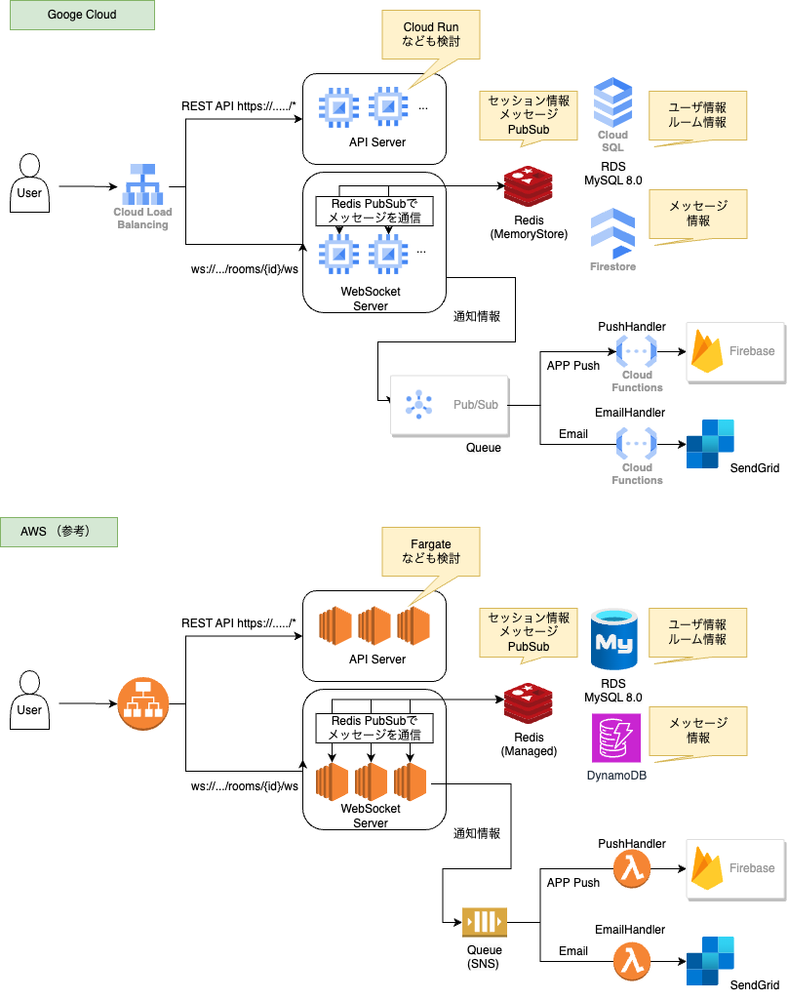
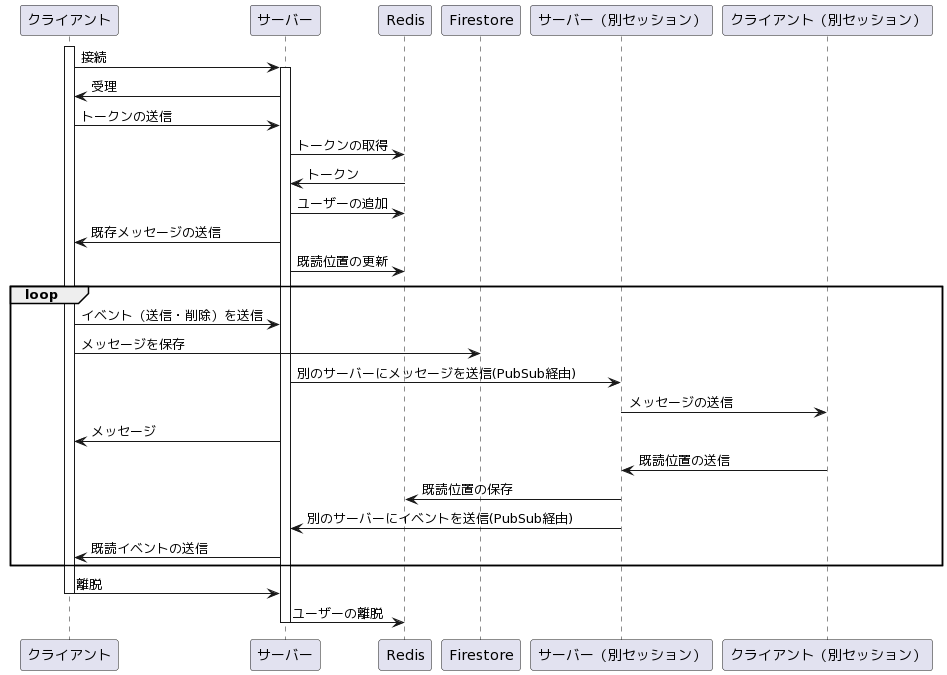
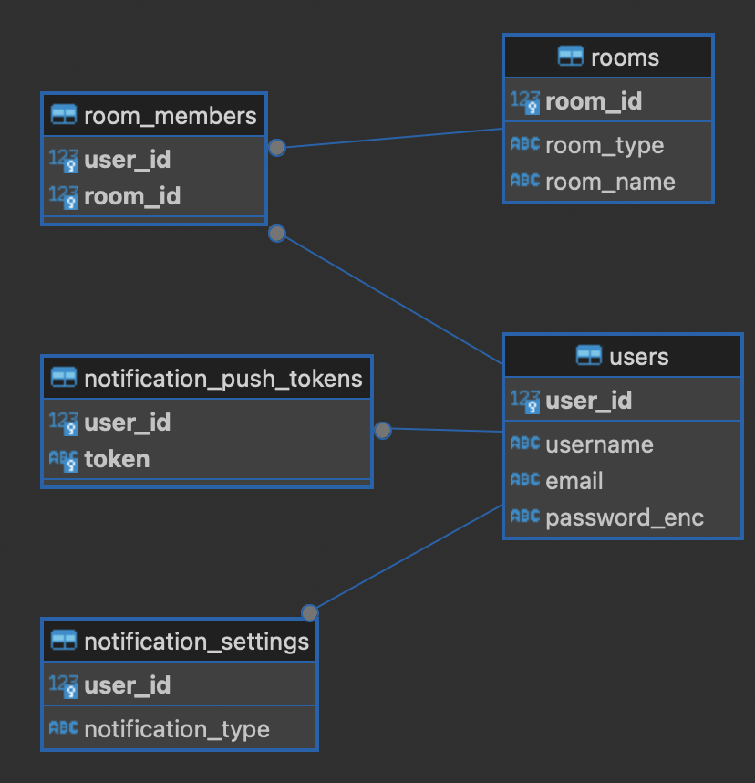

# Chat-App

## 動作

```
docker-compose stats

poetry install
poetry shell

docker-compose up
python init_db.py
uvicorn main:app --reload

python test_schenario.py

```

## 技術仕様

- 言語: Python
- フレームワーク: FastAPI, SQLAlchemy
- DB
    - RDB: SQLite (or MySQL)
        - ルーム情報やユーザー情報などを保存
        - 書き込み回数は少ない
    - KVS: Redis
        - ユーザーセッションと、WebSocketサーバークラスタを通信するためのPubSubや既読位置などを保存
    - KVS: Firestore
        - メッセージを保存

## インフラ構成

Google Cloud を前提としたが、それぞれのコンポーネントは用意に同等のシステムと代替が可能




## チャットの通信フロー





## RDBのER





## TODO

- Terraform定義
- ルームやメンバーの削除実装
- 登録のフロー（メール送信）
- アカウント削除
- アカウント検索